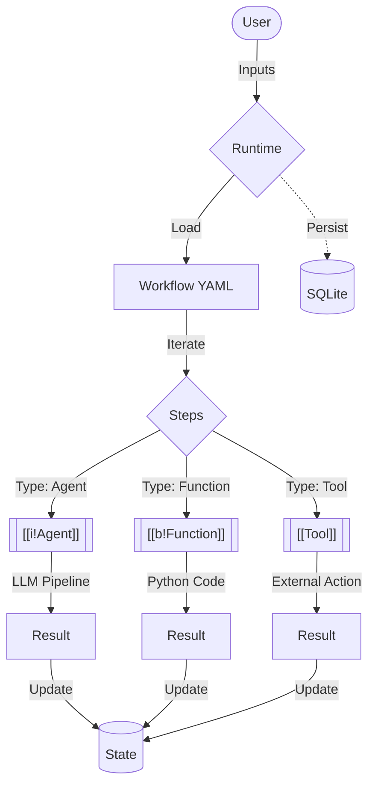

# **Knowledge Base**

Welcome to the **Agentic Runtime** Knowledge Base. This page explains the core architecture, the building blocks of the system, and how they interact to provide a deterministic, observable execution environment for AI agents.

---

## **The System Architecture**

At its core, `agentic-runtime` is a high-performance orchestration layer. It bridges the gap between static definitions and dynamic AI execution.

---

## **Core Building Blocks**

Every solution in the runtime is built using these five essential primitives:

| Block | Role | Integration |
| :--- | :--- | :--- |
| [[i!Workflow]] | The YAML "Recipe" | Describes the sequence of operations. |
| [[i!Agent]] | LLM-backed Intel | Powers complex reasoning and decision making. |
| [[b!Function]] | Python Logic | Executes pre-defined, deterministic code blocks. |
| [[Tool]] | External Bridge | Connects the runtime to APIs, databases, or local files. |
| [[b!State]] | Memory Layer | The thread of data that weaves through every step. |

---

## **Workflow vs. Agent Definitions**

It is important to distinguish between the **Orchestra** (Workflow) and the **Performer** (Agent).

::::tabs
:::tab [[i!Workflow Definition]]
Located in `workflows/`.
- **Purpose**: Defines the inputs, the sequence of steps, and the data mapping between them.
- **Analogy**: The script of a play.
:::
:::tab [[i!Agent Definition]]
Located in `agents/`.
- **Purpose**: Describes a specific AI's personality, model choice (e.g., GPT-4, Claude), and the specific tools it has access to.
- **Analogy**: The actor playing a specific role.
::::

---

## **How They Tie Together**

1. **Initialization**: You provide a [[i!Workflow]] and initial inputs.
2. **Registry Building**: The runtime loads the YAML and builds a registry of all referenced [[b!Function]]s and [[Tool]]s.
3. **Step Execution**: 
   - For an `agent` step, the runtime resolves the [[i!Agent]] definition and triggers its LLM pipeline.
   - For a `function` step, it triggers a direct Python call.
   - For a `tool` step, it executes the tool's `execute()` method with the provided context.
4. **State Persistence**: After every successful step, the [[b!State]] is updated and a snapshot is saved to the [[i!Run]] record in SQLite.

---

## **Data Flow Patterns**

The runtime uses a strict, injectable data flow model:

- **Inputs**: Accessed via `inputs.<name>`.
- **Step Results**: Accessed via `steps.<step_id>.<field>`.
- **Global Context**: Shared metadata accessible to all blocks.

> [!TIP]
> Use the `-i` flag in the CLI to override any input at runtime, or use environmental variables for sensitive API keys.

---

## **Next Steps**

- [Getting Started](getting-started.md) — From zero to your first run.
- [Manual](manual.md) — Deep dive into all CLI commands.
- [Tools](tools.md) — Learn how to build your own external bridges.
