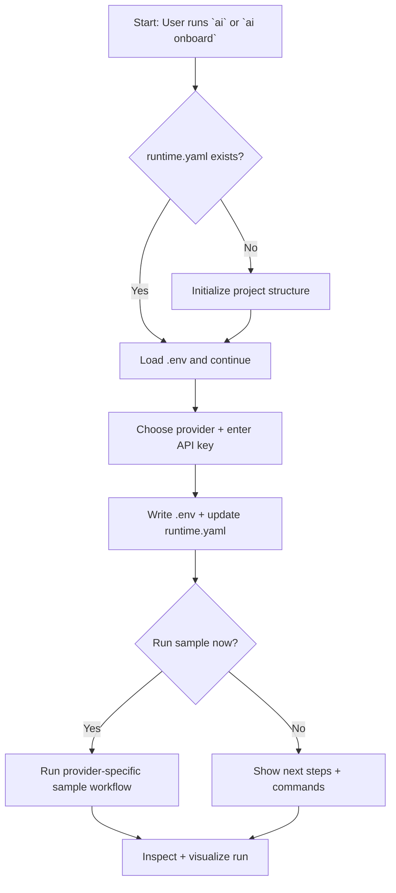

# Onboarding Walkthrough

This walkthrough is a guided path for a first-time user, designed to match
the "single-command onboarding" style common in modern CLIs. It pairs a
quickstart wizard with optional manual steps for folks who prefer scripts.

## Quickstart (Interactive)

If you do not have a project folder yet, create one first:

```bash
mkdir my-agent
cd my-agent
```

Run either of the following in your project root:

```bash
ai
```

or:

```bash
ai onboard
```

The home screen will offer numbered actions; choose **Guided setup** to launch the wizard.

The wizard will:
1. Initialize the project structure if missing.
2. Configure an LLM provider and API key.
3. Offer to run a sample workflow.

## Visual Walkthrough



## Scripted Walkthrough

Removed — use `ai onboard` for the guided flow.
